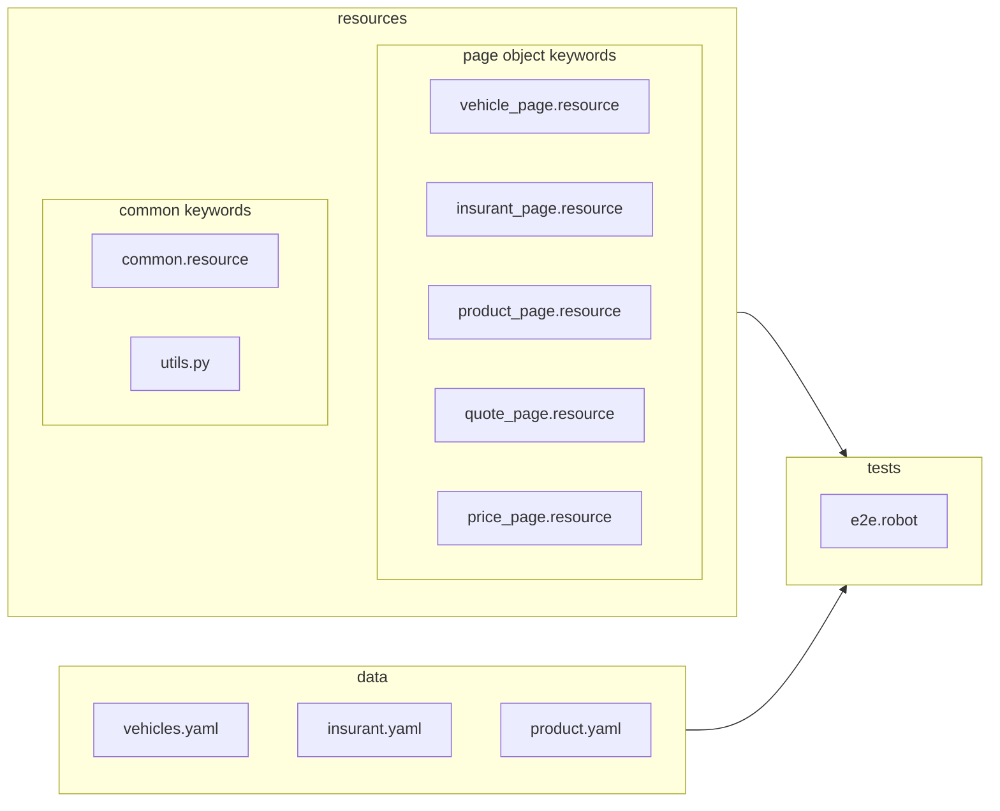

# robotframework-browser-demo
Web automation with Robot Framework and Browser library

```mermaid
flowchart LR
     subgraph tests
      e2e.robot
    end
    subgraph data
      vehicles.yaml
      insurant.yaml
      product.yaml
    end
    subgraph resources
      subgraph page object keywords
        vehicle_page.resource
        insurant_page.resource
        product_page.resource
        quote_page.resource
        price_page.resource
      end
      subgraph common keywords
        common.resource
        utils.py
      end
    end
 resources & data --> tests
```
