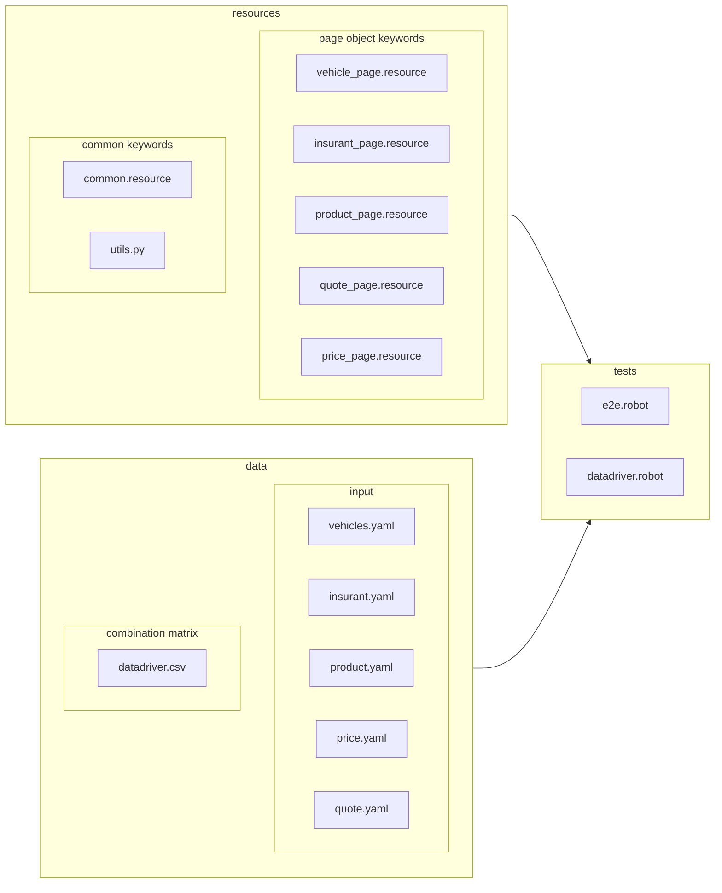

# Robot Framework and Browser library

This project presents how [Robot Framework](https://robotframework.org/) and [Playwright](https://playwright.dev/)-based [Browser](https://robotframework-browser.org/) library can be used to perform GUI tests of web applications.

All tests were prepared for [Vehicle Insurance Application](http://sampleapp.tricentis.com/101/index.php), the sample app made by [Triscentis](https://www.tricentis.com/).

# Requirements

- Python 3.10 or higher
- Node.js

# Project structure

Project is organized as an adaptation of [page object pattern](https://www.guru99.com/page-object-model-pom-page-factory-in-selenium-ultimate-guide.html) in Robot Framework, utilizing its benefits of an easy split between technical and business layers. 

`resources` folder contains all locators and keywords defining actions to be taken on each page, `tests` - test suites, `data` - all test data put in a .yaml file for each page, easily maintainable/extendable.

Two test suites mean two testing approaches. `e2e.robot` is a more 'classic' way, its purpose is to verify the user journey and basic functionalities. `datadriver.robot` makes use of a [DataDriver](https://github.com/Snooz82/robotframework-datadriver) library. It still uses the same keywords and .yaml files as an input, but it tests multiple combinations by passing them through `datadriver.csv` file to a single test template.

# Setup (Windows)

1. Clone/download this repository.
2. Activate virtual environment: `python -m venv venv` and `venv\Scripts\activate.bat`.
3. Install dependencies: `pip install -r requirements.txt`.
4. Install the node dependencies: `rfbrowser init`.
5. Run both test suites, browser and headless mode can be changed: `robot -v browser:chromium -v headless:false  tests/`.
